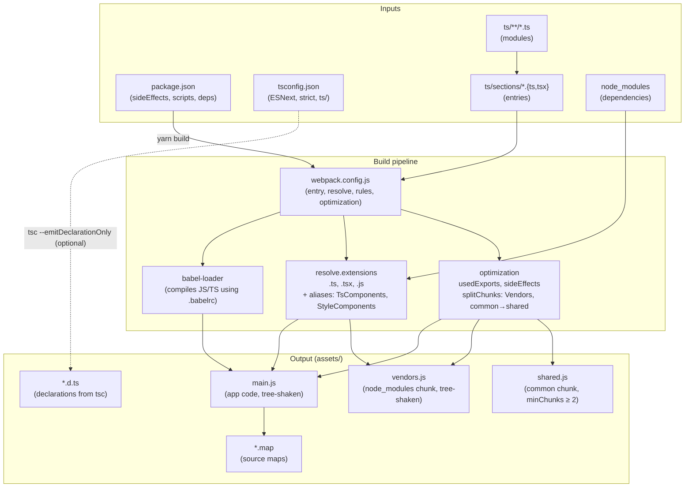
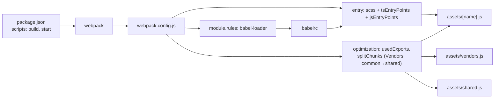
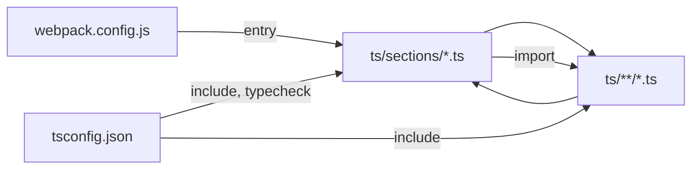
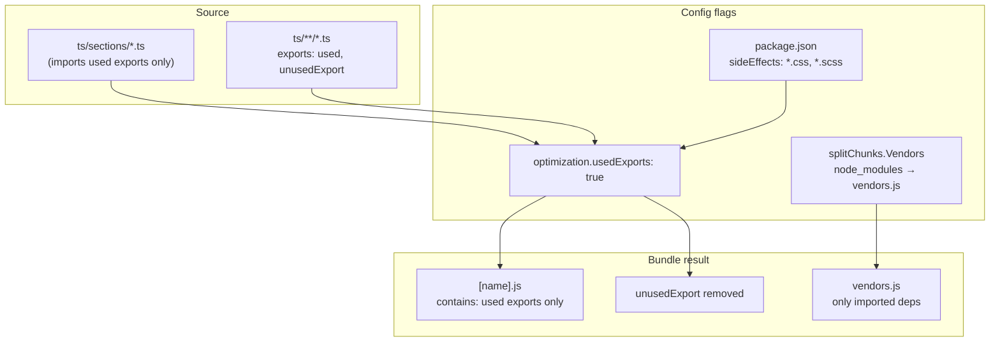

# Module update — Architecture & build

This document describes how the project is structured, how the build pipeline works, and how configs and outputs connect. For comparison with the main theme (New-theme) and operational deep dives, see **REFERENCE.md**.

---

## 1. Overview

This project is a **TypeScript + JS/SCSS** build with:

- **Entry pattern:** `...scssEntryPoint`, `...tsEntryPoints`, `...jsEntryPoints` — SCSS from `scss/sections/*.scss`, TS from `ts/sections/**/*.{ts,tsx}`, JS from `js/sections/**/*.{js,jsx}` (one bundle per section file).
- **Tree-shaking** of app code and `node_modules` (Vendors chunk).
- **TypeScript** via Babel (type-check with `tsc` and ForkTsCheckerWebpackPlugin; no emit in normal build).

---

## 2. Project layout

```
Module update/
├── package.json          # Scripts, sideEffects, deps (babel, webpack, typescript, sass, postcss, etc.)
├── tsconfig.json         # TypeScript: rootDir ts/, include ts/**/*, noEmit, baseUrl
├── .babelrc              # Babel: preset-env (modules: false), preset-react, preset-typescript, transform-runtime
├── .eslintrc.cjs         # ESLint for ts/ (used by eslint-webpack-plugin)
├── webpack.config.js     # Entry (scss + ts + js), babel-loader, SCSS, ForkTsChecker, ESLint, tree-shake + Vendors + shared
├── postcss.config.js     # tailwindcss, postcss-preset-env (autoprefixer)
├── ts/
│   ├── sections/         # One entry per .ts/.tsx file (one bundle per section)
│   └── components/       # TsComponents alias
├── js/sections/          # Optional JS/JSX section entries
├── scss/
│   ├── sections/         # One CSS bundle per .scss file (e.g. common-imports.css)
│   └── components/       # StyleComponents alias
├── assets/               # Webpack output: [name].js, vendors.js, shared.js, [name].css
├── ARCHITECTURE.md       # This file
└── REFERENCE.md         # Comparison with New-theme, deep dives (tree-shaking, aliases)
```

---

## 3. How the build is wired

| Piece | Role | Links to |
|-------|------|----------|
| **package.json** | Scripts `start`, `deploy`, `typecheck`, `lint`, `emit-declarations`; `sideEffects`: `["*.scss"]`; deps. | `yarn start` runs `tsc --noEmit && webpack --watch`; `yarn deploy` runs `webpack && shopify theme push`. Babel uses `.babelrc`. |
| **tsconfig.json** | TypeScript under `ts/`; `rootDir: "./ts"`, `noEmit: true` (type-check only). | `yarn typecheck`; optional `yarn emit-declarations` writes `.d.ts` to `outDir`. |
| **webpack.config.js** | Entry: scss + ts/sections + js/sections. babel-loader, SCSS, ForkTsCheckerWebpackPlugin, ESLintPlugin, aliases (TsComponents, StyleComponents), output `assets/`, splitChunks (Vendors + common). | Glob entries; one bundle per section file. |
| **.babelrc** | preset-env (modules: false), preset-react, preset-typescript, transform-runtime. | Used by `babel-loader` for .js, .jsx, .ts, .tsx. |
| **.eslintrc.cjs** | ESLint config for `ts/`. | Used by eslint-webpack-plugin during build. |

**Flow:** `package.json` → `webpack` → `babel-loader` + `.babelrc` + ForkTsChecker + ESLint → `assets/`.

---

## 4. Design diagram (Mermaid)



---

## 5. Config flow



---

## 6. File dependency chain



---

## 7. Tree-shaking (your code + node_modules) — end-to-end

- **package.json**  
  `"sideEffects": ["*.scss"]` — only SCSS is side-effectful; JS/TS can be tree-shaken.

- **webpack.config.js**  
  - `optimization.usedExports: true` — marks used exports; minimizer drops unused.  
  - `splitChunks.cacheGroups.Vendors` — `node_modules` in one chunk (`vendors.js`); tree-shaken.  
  - `splitChunks.cacheGroups.common` → `shared.js` (minChunks: 2).

**Result:** sideEffects + usedExports + Vendors chunk + common chunk = tree-shaken app code + tree-shaken node_modules in `vendors.js` + shared code in `shared.js`.

### Tree-shaking pipeline (Mermaid)



---

## 8. TypeScript support — end-to-end

- **Babel:** `.babelrc` includes `@babel/preset-typescript`; `babel-loader` compiles `.ts`/`.tsx` (types stripped; no type-check).
- **Webpack:** `resolve.extensions` includes `.ts`/`.tsx`/`.js`/`.jsx`; `resolve.alias`: TsComponents (→ `ts/components`), StyleComponents (→ `scss/components`). One rule: `test: /\.(js|jsx|ts|tsx)$/`, `loader: 'babel-loader'`. ForkTsCheckerWebpackPlugin runs type-checking; ESLintPlugin lints `ts/`.
- **tsconfig.json:** `rootDir: "./ts"`, `include: ["ts/**/*"]`. Used for `yarn typecheck`, ForkTsChecker, and IDE; Babel does not use it for transpilation. To emit declaration files, run `yarn emit-declarations` (optional).

**Flow:** TS/JS in `ts/` and `js/` → babel-loader (.babelrc) → bundle in `assets/`; type-check with `tsc --noEmit` and ForkTsCheckerWebpackPlugin.

---

## 9. Scripts

| Script | Description |
|--------|-------------|
| `yarn start` | Type-check then development webpack build + watch (`tsc --noEmit && NODE_ENV=development webpack --watch`). |
| `yarn deploy` | Production webpack build then `shopify theme push`. |
| `yarn typecheck` | `tsc --noEmit` (type-check only, no emit). |
| `yarn lint` | ESLint on `ts/` (`.ts` only). |
| `yarn emit-declarations` | `tsc --emitDeclarationOnly` (optional; writes `.d.ts` to `outDir`). |

---

## 10. Package entry

- **package.json:** `main` is `assets/main.js`; `types` is `dist/index.d.ts` (after `yarn emit-declarations`). Entry bundles are named by section file (e.g. `new.js` from `ts/sections/new.ts`). Declarations come from `tsc --emitDeclarationOnly` only.

---

## 11. Quick reference

| Link | Description |
|------|-------------|
| **package.json → webpack** | `yarn build` runs `webpack`; `sideEffects` affects tree-shaking. |
| **webpack.config.js → TypeScript** | `babel-loader` compiles `.js`/`.jsx`/`.ts`/`.tsx` using `.babelrc`; `tsconfig.json` is for `yarn typecheck` only. |
| **webpack.config.js → entry** | `entry: { ...scssEntryPoint, ...tsEntryPoints, ...jsEntryPoints }` (scss from `scss/sections/*.scss`, ts from `ts/sections/**/*.{ts,tsx}`, js from `js/sections/**/*.{js,jsx}`). |
| **webpack.config.js → node_modules** | `splitChunks.cacheGroups.Vendors` with `test: /node_modules/` puts deps in `vendors.js`; only imported modules are included. |
| **webpack.config.js → path aliases** | `resolve.alias`: `TsComponents` → `ts/components`, `StyleComponents` → `scss/components`. Add matching `paths` in `tsconfig.json` if you use aliases in imports. |
| **webpack optimization → shared** | `splitChunks.cacheGroups.common` (minChunks: 2) produces `shared.js` for code used in two or more chunks. |
| **tsconfig.json** | `rootDir: "./ts"`, `include: ["ts/**/*"]`. Used by `yarn typecheck`, ForkTsCheckerWebpackPlugin, and IDE. JS output is from webpack only. |

---

## 12. Where the project lives

- **Path:** `Module update/` (workspace root).
- To use it elsewhere, copy or move the project folder and run `yarn install`.
- **Package:** `module-update`; section bundles in `assets/` (e.g. `assets/new.js`); types are emitted to `outDir` when you run `yarn emit-declarations`.
